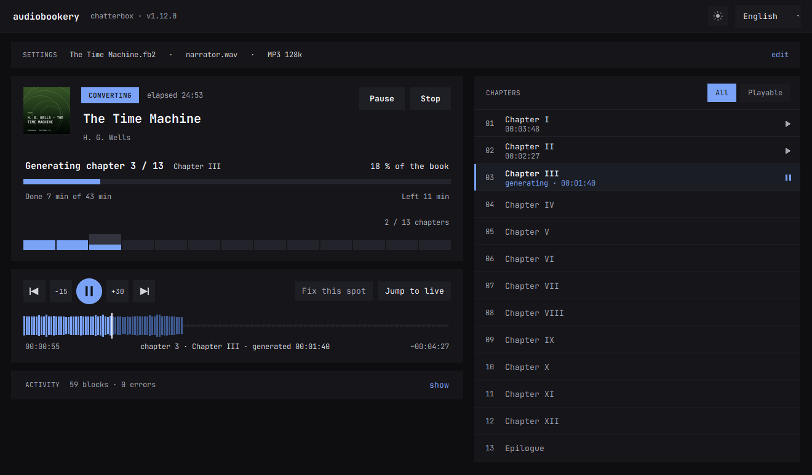
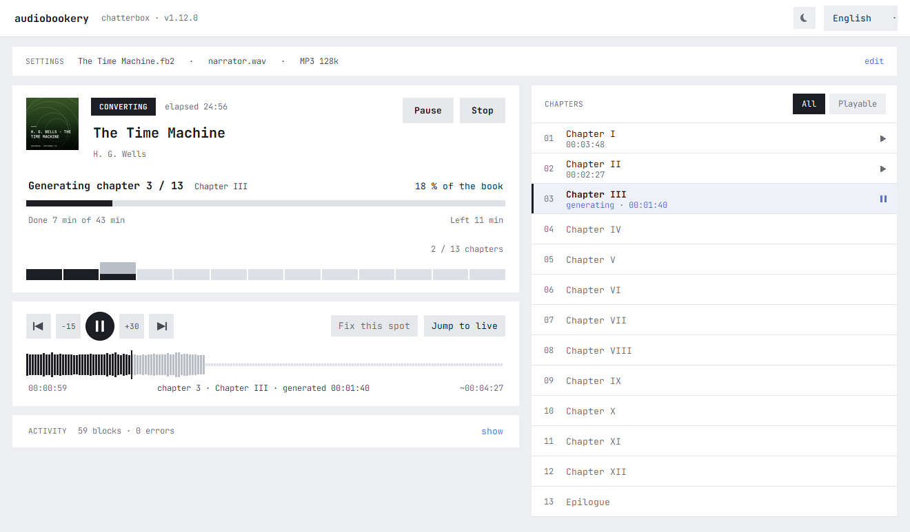

# Audiobookery

Turn the e-books you own into audiobooks, entirely on your own machine.

Text goes in, a finished audiobook comes out — read in a voice you choose, with
no cloud service, no account, and no per-character billing. Built on
[Chatterbox TTS](https://github.com/resemble-ai/chatterbox) by Resemble AI.

*[Česká verze / Czech version](README.cs.md)*





---

## What it does

- Reads **TXT, EPUB, FB2, HTML** and Markdown, detecting the encoding on its own
- Cleans the text, rejoins hard-wrapped lines and splits it into blocks by sentence
- Generates speech in **29 selectable languages** — 23 built into the base model,
  6 more through community checkpoints downloaded on demand
- **Clones a voice** from a short reference recording
- **Plays while it converts**, so you can start listening before the book is done
- Writes one WAV as it goes, optionally converts to MP3 with an embedded cover
- Generates a **cover image** from the book title, entirely offline
- Dark, deliberately plain interface in English or Czech

## Requirements

| | |
|---|---|
| OS | Windows 10/11 (the launcher is a `.bat`; the Python code itself is portable) |
| GPU | NVIDIA with ~4 GB free VRAM. CPU works but is far slower. On Apple Silicon T3 can run [on the GPU cores](#t3-on-the-gpu-cores-apple-silicon) |
| Python | 3.10+ — [uv](https://docs.astral.sh/uv/) is used if present, otherwise `venv` |
| Disk | ~8 GB — 3 GB base model, 2.5 GB PyTorch, 2.1 GB per language checkpoint |
| Optional | `ffmpeg` on PATH for MP3 export |

Measured on an RTX 2080 Ti: **1.44× realtime** with two parallel processes,
0.91× with one. An eight-hour audiobook takes about five and a half hours.

## Getting started

```bash
git clone https://github.com/iammartinj/audiobookery-tts.git
```

Then run `run.bat`. On first launch it creates `.venv`, installs PyTorch with
CUDA and the remaining dependencies, and starts the application. The speech
model (~3 GB) downloads on first generation, not at install time.

Everything lands next to the script in `model_cache/` — nothing is written to
your user profile except a 34 MB Chinese segmenter that a dependency insists on
placing in `~/.pkuseg`.

## Using it

The window opens on the settings card and a *ready to convert* card. Settings
sit in three columns:

1. **Source** — the book and the language it is written in.
2. **Voice** — a reference recording, 10–20 s of clean speech, mono. Without
   one you get the model's built-in English-speaking voice, which will read
   every language with an English accent. **Play** next to the test sentence
   lets you check before committing to a whole book.
3. **Output** — file name, folder, WAV or MP3 with an estimated size, and
   switches for the cover, click removal, edge trimming and the fast decoder.
   Expressiveness, pace, temperature, block size, seed and the transcription
   check are under *advanced…*.

**Start conversion** collapses the settings into one summary line and shows the
conversion: the cover, progress through the book, a strip with one bar per
chapter, the player and a chapter list. Unfinished conversions are listed on the
opening screen with a *continue* link.

The ☀/☾ button in the header switches between the dark and the light scheme.
The window adapts to its size — on a small screen the columns stack and the
content scrolls, so nothing ends up below the edge.

### Listening while it converts

The player plays straight from the output folder: finished chapters and the one
being generated, which it keeps reading as blocks arrive. There is no head start
to wait for. You can skip anywhere in what has been generated, move ±15/30 s,
jump between chapters or pick one from the list, and *jump to live* goes to the
newest audio. When playback catches up with generation, it waits for the next
block.

The waveform under the controls covers the chapter being played: the played part
in full colour, the generated part muted, the rest of the chapter — its length
estimated from the text — as a flat line.

### Preparing a reference recording

Find a continuous stretch bounded by pauses:

```bash
ffmpeg -hide_banner -i source.mp3 -af "silencedetect=noise=-32dB:d=0.6" -f null -
```

Cut it straight into the format the model uses natively — mono, 24 kHz:

```bash
ffmpeg -y -ss 47.65 -t 14 -i source.mp3 -vn -ac 1 -ar 24000 -af "loudnorm=I=-20:TP=-3:LRA=7" -c:a pcm_s16le voices/my_voice.wav
```

Avoid the very beginning of a recording — it usually holds a jingle or a title
announcement in a different voice.

## Parallel generation

Generation is not limited by the GPU's compute power. Measured during a single
stream, the card sits at **38 % utilisation with 15 % memory bandwidth** — the
bottleneck is per-token overhead, not arithmetic. The fix is genuine
parallelism, which Python threads cannot provide because of the GIL.

Audiobookery therefore runs several **separate processes**, each with its own
copy of the model, and reassembles the blocks in order. Measured on an
RTX 2080 Ti:

| processes | speed | GPU |
|---|---|---|
| 1 | 0.91× realtime | 38 % |
| 2 | **1.44× realtime** | 100 % |

The number of processes is chosen from free VRAM (~4.3 GB each) and capped at
four; set it manually under *advanced settings*, or leave it at 0 for automatic.
When more than one process is used the parent does not load a model at all —
that memory goes to a worker instead.

Each block's seed is derived from its index, so the result does not depend on
how many processes are running or which one happened to take the block.

### What it costs you while it runs

Parallel generation works precisely by keeping the GPU busy, and that has a
price. Measured with two processes on an RTX 2080 Ti:

| | |
|---|---|
| GPU utilisation | 98 % (median), 100 % peak |
| VRAM | 10.2 GB of 11.2 GB — about 1 GB left |

The machine stays perfectly usable for ordinary work — browsing, writing, mail —
because the processes spend their time waiting on the GPU rather than the CPU.
Anything that wants the graphics card, though, will not get it: games, video
editing, other local models. There is no VRAM left for them either.

If you want to keep the card free, set *parallel processes* to **1**. That drops
the speed to 0.91× realtime but leaves the GPU at around 38 %, which is what the
application did before this feature existed.

### Fast decoder

The last stage turns speech tokens into audio. Chatterbox Turbo ships a
distilled version of that decoder, which needs 2 flow steps instead of 10 and
no separate CFG pass. It is **off by default** because it downloads 1.1 GB the
first time; switch it on under *advanced settings*.

Measured on an RTX 2080 Ti, eight blocks, 48 s of audio:

| | standard | fast decoder |
|---|---|---|
| decoder per block (same tokens, median) | 0.73 s | 0.17 s |
| decoder share of total time | 12 % | 3 % |
| whole conversion | 0.98× realtime | 1.09× realtime |

The decoder gets four times faster, but the conversion only about 11 % faster:
on CUDA 88 % of the time goes into T3, the model that produces the tokens. How
much you gain depends on how large a share the decoder takes on your hardware.

Only the flow part of the checkpoint differs. The vocoder, speaker encoder and
speech tokenizer are bit-identical to the multilingual model's, so reference
voices keep working. The checkpoint comes from an English model, but the
decoder works on language-neutral speech tokens; compared by ear on Czech, the
two decoders sounded alike.

Switching it on changes the fingerprint of an unfinished book, so a conversion
continues only with the setting it was started with.

### T3 on the GPU cores (Apple Silicon)

The fast decoder helps least exactly where most of the time goes: T3, which
produces the speech tokens one at a time. On an Apple Silicon Mac that stage
can run in [MLX](https://github.com/ml-explore/mlx) instead of PyTorch, on the
GPU cores. It is **off by default** — pick a precision under *advanced
settings*, where the option appears only on Apple Silicon.

Measured on an M4, 96 text tokens and about 200 speech tokens per generation,
20 runs each:

| T3 precision | tokens/s | T3 parameters |
|---|---|---|
| PyTorch on `mps` | 27 → 22, decaying | 2.14 GB |
| MLX float32 | 58, flat | 2.14 GB |
| **MLX 8-bit** | **158, flat** | **0.70 GB** |
| MLX 4-bit | 158, flat | 0.45 GB |

The PyTorch figure decays across runs for the reason described under
[long books no longer slow down](#long-books-no-longer-slow-down); the MLX path
never builds the analyzer that leaks the hooks, so it stays flat.

8-bit is the one to use. It is near-lossless — KL 8e-5 against float32 on the
first step's speech logits — and exactly as fast as 4-bit, because at this size
the decode loop is bound by per-step overhead rather than memory bandwidth.
4-bit only buys space, at KL 3e-2, so there is little reason to reach for it.
MLX's unquantised 16-bit matmuls came out *slower* than float32 here (34 tok/s),
which is why bfloat16 is not offered.

What this means for a whole block is smaller than the token rate suggests. With
T3 at 8-bit, about 1.3 s of a 3.5 s generation is T3 and the rest is s3gen on
`mps`, so the stage that was dominant stops being the bottleneck. Porting s3gen
would be the next win, not more T3 tuning.

`mlx_t3.py` reimplements T3: the Llama backbone, the learned position tables,
the conditioning encoder and the output head. Parameter names match the torch
checkpoint, so the same `safetensors` file loads with no conversion step, and
language checkpoints work as they do on PyTorch.

Because this replaces `model.t3` outright, chatterbox's alignment analyzer is
never built — and two things depend on it. The MLX port keeps its own analyzer
with the same state and exposes it where the block check looks, so
*transcription check* and the runaway/truncated-block detection keep working;
and the premature-end fix is applied inside `mlx_t3.py`, since
`oprav_predcasny_konec()` cannot reach that path.

Precision is recorded in an unfinished book's corrections fingerprint, so a
change is logged but still lets the book continue. On Windows and Linux nothing
changes: the `mlx` wheels exist only for macOS on arm64, and `requirements.txt`
marks them so `pip` skips those lines entirely.

#### If you bump chatterbox

The MLX path cannot be exercised without an Apple Silicon machine, but the
assumptions it makes about chatterbox can be — and they are, by
[`tests/test_chatterbox_api.py`](tests/test_chatterbox_api.py). Those tests need
neither `mlx` nor a Mac, so they run in the same `unittest discover` as
everything else. If one of them fails after a version bump, it names what to
look at:

| Failing test | What moved | What to re-check |
|---|---|---|
| `test_sledovane_hlavy_se_nezmenily` | `LLAMA_ALIGNED_HEADS` | `ALIGNED_HEADS` in `mlx_t3.py` — different heads mean a different alignment map, so block checking on MLX would quietly stop being meaningful |
| `test_analyzator_drzi_cteny_stav` | the analyzer's state fields | `_ZarovnaniMlx` in `audiobookery.py` and `AlignmentAnalyzer` in `mlx_t3.py` |
| `test_step_bere_next_token` | `AlignmentStreamAnalyzer.step` signature | `oprav_predcasny_konec()` — the premature-end fix would stop applying on the **torch** path too |
| `test_t3_stavi_analyzator_pod_patched_model` | where T3 keeps the analyzer | `stav_zarovnani()` and `_MlxT3.patched_model` |
| `test_t3config_ma_pole_ktera_mlx_cte` | `T3Config` fields | the model construction in `mlx_t3.py` |
| `test_konfigurace_backbonu_ma_klice_ktere_mlx_cte` | the Llama config keys | `Attention` / `MLP` / `LlamaBackbone` in `mlx_t3.py` |

Nothing outside `mlx_t3.py`, `_MlxT3` and `_ZarovnaniMlx` is MLX-specific, so
if the MLX path ever becomes more trouble than it is worth, deleting those three
and the `mlx_presnost` setting takes the feature out without touching anything
else.

### Long books no longer slow down

Two leaks in Chatterbox itself, found and measured by
[@tomhol](https://github.com/tomhol):

- **Forward hooks piled up.** `T3.inference()` resets `self.compiled` just
  before checking it, so every block builds a new alignment analyzer, and that
  analyzer registers forward hooks on three attention layers without keeping the
  handles. Three more hooks per block, each copying attention on every step.
  Audiobookery now removes them before each block. Over 60 identical blocks, the
  last ten used to be 11 % slower than the first ten; with the cleanup there is
  no slowdown.
- **The reference voice was encoded for every block.** With
  `audio_prompt_path`, Chatterbox reloads the WAV and runs it through three
  encoders on each call, outside inference mode, so the result carries an
  autograd graph. It is now encoded once per voice and reused, which saves that
  work and 280 MB of VRAM per process.

Neither change alters the audio. With the same seed the output differs from the previous code by at most 2e-6 per sample, which is no more than two runs of the unchanged code differ from each other.

### Trimming murmur from block edges

After finishing a sentence the model sometimes keeps going, filling what should
be a pause with a low murmur lasting seconds. Measured in a real audiobook, one
such stretch ran **1.17 s at −32 dBFS** where the surrounding speech sat at
−22 dBFS.

Level alone cannot separate the two — eleven decibels is well within the range
of a quiet syllable. The spectrum can: speech always carries consonants, so
10–70 % of its energy sits above 4 kHz, while the murmur measured **3 %**. A
frame counts as speech only if it is loud enough *and* has those high
components.

Trimming happens before the first and after the last speech frame, never
between words, and only when the edge run exceeds 500 ms. A quarter second of
decay is kept so a vowel ending a sentence survives. The pause is then supplied
by the application's own inserted silence.

Verified against the recording the problem was reported in: of 1.30 s of real
murmur, 0.26 s remains. Across eight freshly generated blocks, seven were left
untouched and none lost an audible sample.

### When the model does not stop, or stops too early

Edge trimming handles a second of murmur. It cannot help when the model loses
its place in the text. Chatterbox forbids the end-of-speech token until its
attention reaches the end of the text, so once that alignment is lost it keeps
generating up to its 1000-token cap. In one reported chapter a 192-character
block ran **25.5 s**, the last 13 s of it murmur and hiss at −25 to −35 dBFS —
loud enough, and with enough high frequencies, to pass for speech.

After every block Audiobookery reads the model's own alignment analyzer, which
records the frame where the text was read to the end (one frame is 40 ms). The
block is generated again with a different seed when:

- more than 1.6 s follows that point, or audible speech continues more than
  0.8 s past it — an added *to siká* after *Prosím*,
- the text was never read to the end, so words are missing,
- a stretch without speech inside the block lasts longer than 3.5 s — silence or
  murmur alike, since a hum at −34 dBFS is too loud to count as a pause, and its
  brief louder flickers do not count as speech either,
- a block over 100 characters reads slower than 9.5 characters per second —
  ordinary narration runs at 13.4, and a drawn-out block is almost always
  padded with murmur.

If all three attempts are flawed, what happens depends on the flaw. A tail can be
cut cleanly, so that attempt is kept with the tail cut 0.8 s after the text
ended. Murmur inside the block, slow reading or an unfinished text cannot be cut
out, so the block is split into shorter parts that are generated separately and
joined in place — a shorter text throws the model off less often. Only where it
cannot be split any further is the least damaged attempt kept.

Calibrated on 58 blocks generated from the book the problem was reported in.
Healthy blocks ran 0–1.48 s past the end of the text, audible speech at most
0.38 s past it, and their longest stretch without speech was 3.0 s, against 3.6
to 11 s where the model murmured between sentences. Of 41 ordinary generations
the check flagged 4, and a transcription confirmed a real fault in every one: a
missing *Ani zdaleka.*, a truncated second sentence, a mangled opening and a name
repeated in a loop. Expect a conversion about a tenth longer.

The previous guard allowed 8 characters per second plus 3 s. Across 612 blocks
of ten chapters it never fired once. It remains only as a fallback for models
without the analyzer, tightened to 10 characters per second — Czech reads at
13.5.

**A bug in Chatterbox that cut sentences off.** Chatterbox 0.1.7 forces the end
of speech as soon as the last two speech tokens are identical — at any point,
because the condition "only after the text is read" is commented out in its
code. Two identical tokens in a row are ordinary, in a longer pause for
instance, so the rest of the block was lost. Audiobookery now lets that rule
apply only once the text has been read. On 45 blocks generated with the same
seeds, the end was forced three times and each time the last sentence was
missing (transcription match 0.84–0.93). With the fix all three were read to the
end (0.98–0.99) and no other block changed. Chatterbox's main branch has since
removed the analyzer altogether, so there is no fixed release to wait for.

### Transcription check

Optional, under *advanced settings*. When every attempt at a block is flawed,
Whisper (`openai/whisper-large-v3-turbo`, 1.6 GB on first use) transcribes each
one and the attempt closest to the text is kept. It runs on the GPU when there
is room next to the voice model, otherwise on the CPU, about 9 s per block on a
Ryzen 9 3950X. It only runs where all attempts failed, so it costs next to
nothing.

It does not find mispronunciations. Whisper's language model smooths over a
single wrong sound: *pšipomínal* comes back as *připomínal*. What it tells apart
reliably is an attempt that is complete from one that lost a sentence. For a
slip like that, fix the passage by hand, as described under
[Chapters and resuming](#chapters-and-resuming).

### Removing clicks from pauses

Audiobookery attenuates short impulses that appear in silent stretches. It is
on by default and can be turned off under *advanced settings*.

The filter is deliberately narrow. It works out the noise floor of each block,
marks pauses where the envelope stays below three times that floor for at least
150 ms, **shrinks each pause by 30 ms at both ends** so that speech onsets and
tails are out of reach, and only then looks for impulses above eight times the
floor that last **less than 15 ms** — short enough to exclude a breath. Those
are faded down to the level of the surrounding room tone rather than cut out,
since a hard edit would produce a click of its own.

Measured on three recordings, it attenuates 22–34 spots per five minutes,
touching **0.04–0.08 % of the track** and reducing the loudest offenders by
10–23 dB. The property that matters is verifiable rather than promised:

```
changed samples outside pauses : 0
speech identical bit for bit   : True
```

The pause keeps its cloned room tone, so nothing drops into dead digital
silence.

### min_p, and a measurement that failed

Occasional short clicks appear in quiet passages. Measuring a six-minute
recording against its reference clip pinned down where they come from:

| | generated | reference |
|---|---|---|
| noise floor in silence | −57 dBFS | −58 dBFS |
| spikes in silence (\|x\| > 0.02) | 53 | 0 |

The **noise floor is faithfully cloned** from the reference — room tone and all —
which is expected. The spikes are not in the reference at all, and they sit
seconds away from block joins, so they are neither the concatenation nor the
inserted pauses. The model produces them.

The obvious suspect was low-probability token sampling, so `min_p` is now
exposed under *advanced settings*. It cuts the tail of the probability
distribution using a threshold relative to the best token, which in theory
removes glitch tokens without flattening natural variation.

**It did not work.** Measured over 280 s per setting with identical seeds:

| min_p | clusters | per minute | forced EOS (repetition) |
|---|---|---|---|
| 0.05 (default) | 21 | 4.5 | 1 |
| 0.12 | 25 | 5.3 | 2 |
| 0.20 | — | 6.6 | — |

Raising it did not reduce the clicks and mildly increased the repetition stalls
that the alignment analyser has to break by forcing an end-of-speech token. The
default therefore stays at the library's 0.05. The control is left in place for
anyone who wants to experiment — and so the negative result is on record rather
than repeated.

## Fixing pronunciation

Czech spelling hides a rule the letters do not carry: after **d, t, n** the
vowel decides the consonant. *ti* is read soft, *ty* hard. The model sometimes
gets this backwards and reads *tichý* as *tychý*. Writing **ťichý** forces the
soft reading, and measurement over six seeds showed the unusual spelling does
not destabilise generation — the length spread is the same as without it.

[`vyslovnost.json`](vyslovnost.json) holds those rewrites. The same file solves
foreign names, which the model reads with Czech spelling rules:

```json
{
  "nahrady": {
    "tich*": "ťich*",
    "Shakespeare": "Šejkspír"
  }
}
```

Rules apply to whole words only, so a key never reaches inside another word —
`ti` will not touch *politika*. Capitalisation is carried over, including full
caps for chapter headings. A trailing `*` matches a prefix and keeps the rest
of the word, which matters in an inflected language: `tich*` covers *tichý,
tichá, tiché, tichého, tichem* without listing every case.

**There is no blanket rule and there should not be.** Rewriting every *ti* to
*ťi* would break loanwords — *politika*, *matematika*, *technika*, *diktát* are
all read hard — trading an occasional error for a systematic one. Add only the
words you actually hear going wrong.

Both dictionaries are part of the resume fingerprint — the Czech one below only
for Czech books — so changing either stops a half-finished book from continuing
with a different pronunciation.

### A Czech dictionary from Wiktionary

For Czech books Audiobookery also applies
[`vyslovnost_cs.json`](vyslovnost_cs.json): 53,330 word forms that get a háček
where the soft reading is confirmed. It comes from Wikislovník, the Czech
Wiktionary, which gives the pronunciation of its entries in IPA — and IPA does
tell the two readings apart: *tichý* [cɪxiː], *politika* [pɔlɪtɪka].
[`vyslovnost_wiki.py`](vyslovnost_wiki.py) aligns every *ti/di/ni* in the
spelling with the consonant in the IPA and adds the háček only where the IPA
says soft. Inflected forms inherit the reading from their headword, but only for
the part of the word they share with it; reflexive verbs and forms negated with
*ne-* are covered as well.

The IPA turned out not to be equally reliable everywhere. Entries with a native
speaker's recording are right, while rare entries without one are often
transcribed naively from the spelling, loanwords included — *anestetický*
[anɛstɛcɪtskiː]. Entries with a recording are therefore trusted fully. Without
one, a soft ending is accepted, where grammar decides the reading (*poslední,
spojení, ním, posadil*), and a soft stem only when the word does not look
borrowed.

Whether a word looks borrowed is learned from Wikislovník itself. A hard
*ti/di/ni* written into the IPA is deliberate, so those 2,547 words are
loanwords (*politika, diplom, titul*); soft ones confirmed by a recording are
native. More native examples come from letter patterns that loanwords
practically never have. Each pattern is first checked against the 2,547
loanwords and kept only if it occurs in at most two of them: *-ník, -ština*,
numerals such as *deseti-*, *proti-*, *-tivý*, and *tiš-, nij-, nič-* at the
start of a word. Patterns that failed stayed out — *ř* and *ů* (*diář*), *nič*
inside a word (*botanička*), *-tivá* in noun cases (*lokomotivám*). A naive Bayes
classifier on letter groups then scores the uncertain words, with a threshold set
by five-fold cross-validation so that no more than 1 % of loanwords would pass as
native (measured: 0.94 %). Pronouns, conjunctions and numerals are accepted
without it; loanwords among them are negligible (*aniž, nikomu, totiž*).

| variant | forms | háček inside a loanword | coverage of a Czech novel |
|---|---|---|---|
| every entry | 62,455 | about 1,400 | 73 % |
| entries with a recording only | 4,262 | 0 | 34 % |
| recording, or a soft ending (1.8) | 33,118 | 0 | 63 % |
| **+ loanword detector — shipped** | **53,330** | **none found** | **71 %** |

"None found" rests on a check of the 20,212 forms the detector adds. 598 of
them put the háček before a letter group typical of loanwords (*-iv-, -ism-,
-ist-, -ick-, -iz-, -iál-*); most are numerals (*desetistěnka*), *-tivý*
adjectives and the *divný* family, and the remaining 158 were read one by one —
all native, such as *protivník, protizákonný, tětiva, nizozemština*. The
0.94 % is measured on loanwords that Wikislovník marks hard; one with naive
IPA may behave a little differently, so read it as an estimate, not a guarantee.

Coverage is the share of words containing *ti/di/ni* that get rewritten; the
remainder includes names and loanwords that should stay hard. Some native words
are still missed — *okolností, rameni, místnosti* — so if you hear one go wrong,
add it to `vyslovnost.json`; your own rules run first and win.

Compared by ear on the same sentences, the rewritten text read better. A háček
does not change the length of a word, so block boundaries stay exactly where they
were. The data is licensed CC BY-SA 4.0 and the file inherits that licence — see
[NOTICE.md](NOTICE.md).

## Chapters and resuming

**Chapters.** EPUB and FB2 carry their own chapter structure, so Audiobookery
uses it: with MP3 output you get one file per chapter, numbered and named after
the chapter, each with the cover embedded and proper track metadata. Plain text
has no reliable structure to read, so it stays a single file.

Choosing MP3 means the intermediate WAV is deleted once the conversion
succeeds — no 2 GB leftovers. If the run is interrupted, the WAV is kept
instead: MP3 cannot be appended to, so converting a half-finished book would
close the door on resuming it.

**Resuming.** An eight-hour book is an overnight job, and things get in the way:
a power cut, a reboot, needing the GPU for something else. A progress file is
written next to the output after every block, recording the source fingerprint,
the block reached and the exact sample count in the file being written.

**Pick up an unfinished book** from the list on the opening screen. It shows
interrupted conversions from the output folder with their progress and when they
stopped, so you can come back to a book days later, even after converting
something else in between. Selecting one restores the settings from
the run that was interrupted — voice, language, temperature, output format —
because the fingerprint would not match otherwise.

Starting the same book again also offers to continue where it stopped.
The unfinished chapter is truncated to the last recorded sample — so a block cut
in half by a crash is discarded rather than left as a glitch — and generation
picks up from the next block.

**What blocks resuming.** Settings that change the voice — reference recording,
language, expressiveness, cfg, temperature, min_p, seed, pause, output format and
bitrate — and the way the text is split into blocks. Otherwise the second half of
the book would not match the first, or a shifted block boundary would repeat or
skip a piece of text. Corrections do not block it: the click filter, edge
trimming, the fast decoder and the pronunciation dictionaries only make the rest
of the book better, so a changed correction is noted in the log and the
conversion carries on. A háček from the Czech dictionary does not change the
length of a word, so it never moves a block boundary.

If resuming is not possible, Audiobookery says what changed and asks before
starting over — nothing is deleted without that answer. Starting a book whose
chapter folder already holds files asks before overwriting them as well.

**Passages that fail.** A block the model cannot generate in three attempts is
split into shorter parts, which are tried one by one and put back in the same
place. Only what fails even then is left out, and every such passage is listed
with its block and chapter in `<book> - missing text.txt` next to the output
(`<book> - chybějící text.txt` with the Czech interface).

**Fixing a passage.** *Fix this spot* in the player opens the dialog at the
position being played; *fix a passage in a finished book…* on the opening screen
works on any finished file. Enter the time where you heard the problem; the block is found and its text
shown — after the pronunciation rewrites, so Czech *první* appears as *prvňí*.
The text can be edited and is read exactly as
written, so a stubborn word can be respelled for this one take. *generate again* makes a new take with the
book's voice settings and plays it, *replace in file* swaps it in. MP3 keeps its
tags and cover and is re-encoded once; the previous version is backed up to
`temp/zalohy_oprav/`. A chapter still being written by an interrupted conversion
is not offered, because resuming cuts it to the recorded length.

Every conversion writes `<book>.blocks.jsonl` next to the output with the
position of each block. Files made before 1.11 have no map. Load the same book
with the same characters per block and pause, and the blocks are found from the
silence inserted between them — on all ten chapters of the reported book the
boundaries matched exactly.

Verified on that book's first chapter: the dialog found block 8 at 1:25, a new
take of 16.7 s replaced the 25.5 s one, the next block starts exactly where its
pause ends, and tags and cover survived.

## Languages

The synthesis language is independent of the interface language: a Czech
interface can happily produce an English audiobook.

**23 languages are built into the base model** and need no download — English,
Spanish, German, French, Italian, Portuguese, Dutch, Polish, Russian, Swedish,
Danish, Norwegian, Finnish, Greek, Turkish, Hebrew, Arabic, Hindi, Japanese,
Korean, Chinese, Malay, Swahili.

**Six more come from community checkpoints** (~2.1 GB each, downloaded on first
use) that replace the weights of the T3 module:

| Language | Repository | Verified | Note |
|---|---|---|---|
| Czech | [`Thomcles/Chatterbox-TTS-Czech`](https://huggingface.co/Thomcles/Chatterbox-TTS-Czech) | yes | needs a Hugging Face login |
| Slovak | [`pekiskol/chatterbox-tts-slovak`](https://huggingface.co/pekiskol/chatterbox-tts-slovak) | yes | |
| Portuguese (BR) | [`ResembleAI/Chatterbox-Multilingual-pt-br`](https://huggingface.co/ResembleAI/Chatterbox-Multilingual-pt-br) | no | official, from Resemble AI |
| French | [`Thomcles/Chatterbox-TTS-French`](https://huggingface.co/Thomcles/Chatterbox-TTS-French) | no | improves a native language |
| Persian | [`Thomcles/Chatterbox-TTS-Persian-Farsi`](https://huggingface.co/Thomcles/Chatterbox-TTS-Persian-Farsi) | yes | tokenizer has no `[fa]` token |
| Estonian | [`Mamsu/chatterbox-tts-et-lobiseja`](https://huggingface.co/Mamsu/chatterbox-tts-et-lobiseja) | yes | tokenizer has no `[et]` token |

*Verified* means the checkpoint is byte-for-byte the same size as
`t3_mtl23ls_v2.safetensors` (2,143,989,752 B), so it is a fine-tune of the very
module Chatterbox loads and the weights map key for key. Unverified ones are
loaded anyway; the log reports how many keys did not match.

Add your own in [`modely.json`](modely.json) — no code changes needed:

```json
{"kod": "hu", "nazev": "Magyar", "zdroj": "finetune", "token": true,
 "repo": "user/my-chatterbox-hu", "gated": false, "overeno": false,
 "velikost_gb": 2.1}
```

`token` records whether the tokenizer has a `[code]` token for the language.
Beyond the 23 trained languages, tokens exist for `cs`, `sk`, `bg`, `hu`, `ro`,
`ta` and `vi`.

### A note on Czech

Chatterbox officially lists 23 languages and Czech is not among them, yet it
works. The tokenizer that actually loads contains the `[cs]` token, and Czech
diacritics survive NFKD decomposition intact. The only obstacle is a validation
list inside the package, which Audiobookery extends at startup. The base
weights were never trained on Czech, though — that is what the fine-tune fixes.

The same reasoning applies to Slovak, Bulgarian, Hungarian, Romanian, Tamil and
Vietnamese: the tokens are there, waiting for someone to train them.

## Please read this before publishing anything

**Rights to the book.** Convert only works you are allowed to convert — your own
writing, public-domain texts, or books whose licence permits it. A legally
purchased e-book does not generally give you the right to publish an audio
version of it.

**Rights to the voice.** A reference recording is a real person's voice. Cloning
a narrator or an actor from a commercial audiobook and publishing the result is
a problem on two counts at once — the recording is copyrighted and the voice
belongs to someone who did not agree to it. For private listening the picture is
different, but "I made it for myself" stops applying the moment you share it.

**Do not impersonate.** Do not use a cloned voice to make someone appear to say
something they never said.

**Watermarking.** Chatterbox embeds an inaudible
[Perth](https://github.com/resemble-ai/perth) watermark in everything it
generates. Audiobookery does not remove it, and removing it is not a supported
use of this project.

The authors of this tool are not responsible for what you make with it.

## Models and licensing

| Component | Licence | Note |
|---|---|---|
| Audiobookery | MIT | this repository |
| [Chatterbox TTS](https://github.com/resemble-ai/chatterbox) | MIT | the engine |
| [`ResembleAI/chatterbox`](https://huggingface.co/ResembleAI/chatterbox) | see model card | base weights, downloaded at runtime |
| [`ResembleAI/chatterbox-turbo`](https://huggingface.co/ResembleAI/chatterbox-turbo) | MIT | fast decoder, downloaded only when switched on |
| [`openai/whisper-large-v3-turbo`](https://huggingface.co/openai/whisper-large-v3-turbo) | MIT | transcription check, downloaded only when switched on |
| Language checkpoints | see each model card | community work, terms vary |
| [JetBrains Mono](https://github.com/JetBrains/JetBrainsMono) | OFL 1.1 | bundled in `fonts/`, see `fonts/OFL.txt` |
| Czech pronunciation data from [Wikislovník](https://cs.wiktionary.org/) | CC BY-SA 4.0 | bundled as `vyslovnost_cs.json` |

No model weights are included in this repository. Everything downloads from
Hugging Face on first use, under whatever terms that model carries. Full
attribution and per-model links are in [NOTICE.md](NOTICE.md).

## Project layout

```
audiobookery/
  audiobookery.py      # the whole application
  mlx_t3.py            # T3 in MLX, for Apple Silicon (unused elsewhere)
  preklady.py          # interface strings (en / cs)
  modely.json          # language catalogue
  vyslovnost.json      # your pronunciation rewrites
  vyslovnost_cs.json   # soft ti/di/ni for Czech, from Wiktionary (CC BY-SA 4.0)
  vyslovnost_wiki.py   # regenerates vyslovnost_cs.json
  tests/               # unit tests, no GPU or model needed
  run.bat              # install + launch
  requirements.txt
  fonts/               # bundled JetBrains Mono (OFL 1.1)
  docs/                # screenshots
  model_cache/         # downloaded models        (gitignored)
  voices/              # your reference recordings (gitignored)
  vystup/              # generated audiobooks      (gitignored)
```

Reference recordings, models and generated audio are deliberately kept out of
version control. See [`.gitignore`](.gitignore).

## Troubleshooting

**`CUDA: False`** — a CPU build of PyTorch got installed. Delete `.venv` and run
`run.bat` again. The torch version is pinned to 2.6.0 on purpose: chatterbox-tts
requires exactly that, and without the pin pip replaces the CUDA build.

**`TypeError: 'NoneType' object is not callable` at `PerthImplicitWatermarker`** —
the watermarker imports `pkg_resources`, which ships with setuptools but was
removed in version 81. Hence the `setuptools>=70,<81` pin.

**Install fails on `pkuseg`** — the resolver picked chatterbox-tts 0.1.3, which
needs a package that must be compiled on Windows. `requirements.txt` pins
`==0.1.7`, which uses a prebuilt wheel. It is pinned exactly rather than as a
minimum: Chatterbox's development branch has dropped the alignment analyzer
that the block checks and the sentence cut-off fix rely on, so a newer release
would switch them off without a word.

**`CUDA out of memory`** — lower *chars per block* to about 120, or switch the
device to `cpu`.

**Robotic or unstable voice** — the reference recording matters more than any
parameter. Use 10–20 s of clean speech with no music or echo. Lowering
temperature to 0.6 also helps.

## Contributing

Bug reports and language checkpoints for `modely.json` are both welcome. If you
are adding a model, please say whether you verified it loads and what the log
reported about unmatched keys.

The tests need neither a GPU nor a model and finish in seconds. Run them from the
application folder before sending a change:

```bat
.venv\Scripts\python -m unittest discover -s tests
```

## Thanks

To [@tomhol](https://github.com/tomhol) for tracking down the two leaks that made
long conversions slow down, for pointing out the distilled decoder, and for the
chapter progress bar, remembered sections and a window that fits smaller screens.
